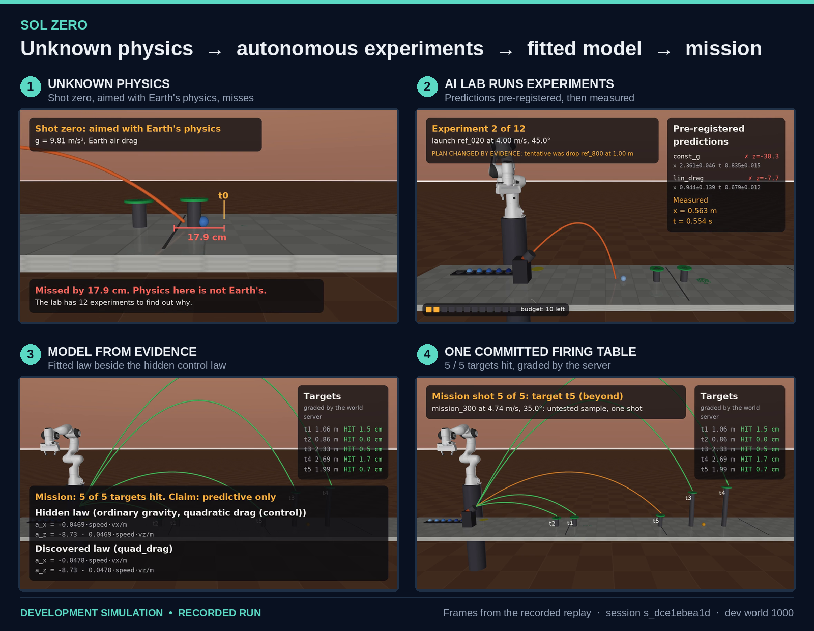
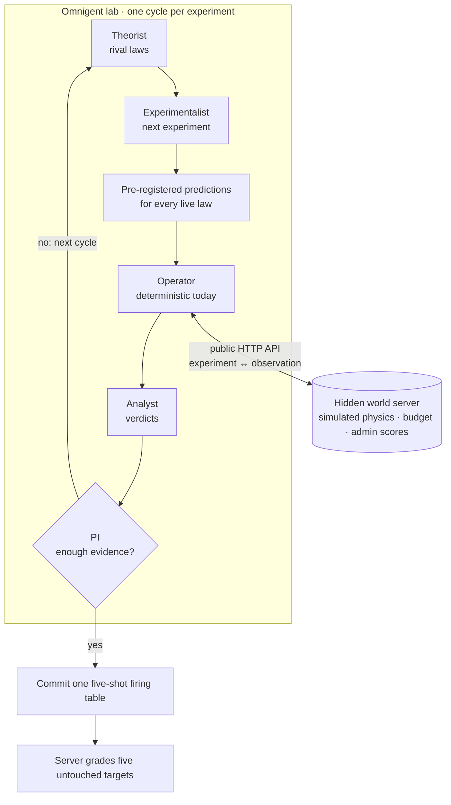
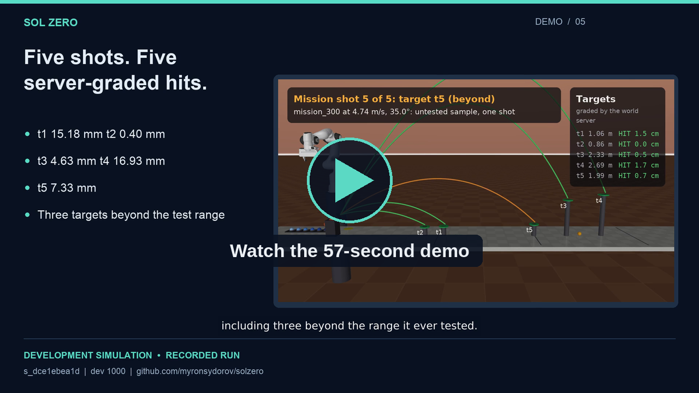

<div align="center">

<h1>Sol Zero</h1>

<p><b>A robot lands in a world whose physics nobody told it.<br>It has 12 experiments to discover the laws — then it has to act.</b></p>

<table>
  <tr>
    <td align="center"><h2>10 / 12</h2>experiments used</td>
    <td align="center"><h2>5 / 5</h2>mission hits</td>
    <td align="center"><h2>3 / 3</h2>beyond tested range</td>
  </tr>
</table>

<p><sub><code>Recorded development run · simulation · dev world 1000</code></sub></p>

<h3><a href="docs/media/demo_60s.mp4">▶&nbsp;Watch 57s Demo</a> &nbsp;·&nbsp; <a href="docs/media/technical_60s.mp4">🧠&nbsp;Technical Walkthrough</a> &nbsp;·&nbsp; <a href="https://solzero.vercel.app">🌐&nbsp;Live Interactive Replay</a></h3>



</div>

## The idea

Most robots assume Earth's physics. Sol Zero asks what happens when that assumption is wrong and nobody says how.

1. **The physics is hidden.** A world server holds a force law the agents cannot see. They only get noisy measurements back over HTTP.
2. **There are at most 12 experiments.** Drops and launches with a robot arm. The server enforces the budget, and a failed measurement still uses one up.
3. **Every prediction is pre-registered.** Before each experiment, the lab writes down what every live hypothesis predicts. Only then does it measure.
4. **Evidence updates the hypotheses.** Laws that miss their pre-registered predictions are rejected. The lab then picks its next experiment, with a disagreement tool showing where the surviving laws differ.
5. **The PI has to stop.** At some point the principal investigator decides the lab knows enough and stops spending budget.
6. **One firing table is committed.** Five shots, one per target, all locked in before any is fired.
7. **The server grades five unseen targets.** Some are farther than anything the lab ever launched.

Nothing about the world is hard-coded into the agents. Abstaining with "insufficient evidence" is an allowed answer.

## How Sol Zero works

| Role | Owns | Runs on |
| --- | --- | --- |
| **Theorist** | The set of live candidate laws and their fitted parameters | Model |
| **Experimentalist** | Which experiment to run next, compared using where the live laws disagree | Model |
| **Operator** | Executing the registered experiment settings through the HTTP API | Deterministic code (current); model-backed in the recorded run |
| **Analyst** | Verdicts on each law once the result is in | Model |
| **PI** | When to stop experimenting, and the final mission commit | Model |

The lab is built on [Omnigent](lab/README.md). Fitting, prediction, disagreement and shot planning are shared numerical tools ([`tools/`](tools)), used identically by every condition.

## Architecture



Every step above is written to a JSONL ledger.

- **Isolation:** agents see public observations over HTTP. The generator code and admin scores stay with the host.
- **Budget:** the server enforces the twelve-experiment limit, and the client mirrors it.
- **Ledger:** a JSONL record of laws, candidate experiments, predictions, results, verdicts, plan changes, nominations and the mission commit.
- **Recovery:** progress is checkpointed. An ambiguous experiment response is never blindly retried.

Every record and endpoint is defined in [SPEC.md](SPEC.md), section 5.

## Recorded result

Session **`s_dce1ebea1d`** on development world 1000, condition `lab`:

| Experiments used | Mission targets hit | Beyond experimental range | Evidence-driven plan changes |
| :---: | :---: | :---: | :---: |
| **10 / 12** | **5 / 5** | **3 / 3 hit** | **6** |

The PI stopped after 10 of the 12 available experiments. The server graded all five mission shots as hits, including the three beyond-range targets.

| Target | Range class | Server outcome | Miss distance |
| --- | --- | --- | ---: |
| t1 | in range | Hit | 15.18 mm |
| t2 | in range | Hit | 0.40 mm |
| t3 | beyond | Hit | 4.63 mm |
| t4 | beyond | Hit | 16.93 mm |
| t5 | beyond | Hit | 7.33 mm |

The PI committed with law `quad_drag` and the claim **`predictive_only`**, with `claims_non_ordinary=false`. World 1000 was unknown to the agents but turned out to be a control world: the replay's final card shows the hidden law as ordinary gravity with quadratic drag.

> **Scope:** this is one completed development run, not a held-out comparative evaluation. It used a model-backed Operator; the current deterministic Operator came later.

## See Sol Zero in 57 seconds

<table>
  <tr>
    <td width="60%">
      <a href="docs/media/demo_60s.mp4"></a>
    </td>
    <td>
      <b><a href="docs/media/demo_60s.mp4">▶ Demo (57 s)</a></b><br>
      Unknown physics, an AI lab choosing its own experiments, pre-registered predictions, and five graded mission shots.<br><br>
      <b><a href="docs/media/technical_60s.mp4">🧠 Technical walkthrough (57 s)</a></b><br>
      The HTTP boundary, agent roles, the experiment loop, the ledger, and server grading.<br><br>
      <sub>Both are recorded simulation replays, not physical-robot footage. Replay time is compressed. Scripts and claim checks: <a href="docs/submission-scripts-60s.md">60 s</a> · <a href="docs/submission-scripts.md">2 min</a> (<a href="docs/media/demo.mp4">demo</a>, <a href="docs/media/technical.mp4">technical</a>).</sub>
    </td>
  </tr>
</table>

**🌐 [Live interactive replay](https://solzero.vercel.app):** the public viewer demonstrates the replay UI with deterministic fixture sessions. The recorded development run's evidence is linked [separately](docs/evidence/lab-dev1000).

## Why this is interesting

- **It tests science, not just curve fitting.** The lab chooses what to measure and when to stop, and it pays for every experiment.
- **It is honest by construction.** Predictions are written down before the measurement, so each law is judged on what it predicted, not on a fit made afterwards.
- **It acts on what it learned.** The test is five one-shot targets, three of them beyond the range of any experiment it ran.
- **It is auditable.** Every hypothesis, prediction, verdict and changed decision is in the ledger, so a reviewer can check the reasoning instead of trusting a summary.

## Evidence and reproducibility

| What | Where |
| --- | --- |
| Ledger, server score, measurement notes, evidence hashes | [`docs/evidence/lab-dev1000/`](docs/evidence/lab-dev1000) |
| Design and interfaces | [SPEC.md](SPEC.md) |
| Measured results and every development decision | [STATUS.md](STATUS.md) |
| Calibration study output | [`calibration/results/dev60/`](calibration/results/dev60) |

The recorded run took about **17.1 active minutes**, with pauses and resumes. Token accounting includes an interrupted response, so it is incomplete.

## Development calibration

The task's difficulty was set on development worlds (seeds 1000 to 1999) with scripted policies, before any agent saw a test world. That covers the launcher noise, the hit radius, the probe set and the target placement. The changes were:

- Launcher actuation error cut from 2% / 0.5 degrees to 0.5% / 0.1 degrees, because even the exact law could hit only 49% of targets.
- A hit radius of max(5 cm, 2% of target distance).
- A probe set of 20 in-range and 20 beyond-range launches.

The human decided each change from measured numbers. Each is logged with before and after values in [STATUS.md](STATUS.md#design-changes-from-calibration-dev-worlds-only). The experiment budget, the parameter ranges and the physics families were never tuned to favour any condition. The four primary metrics are fixed in [SPEC section 7](SPEC.md#7-evaluation). Test seeds 9000 to 9999 were not generated, run or inspected during development.

### Dev-world calibration (scripted policies, 60 worlds)

From [`calibration/results/dev60/primary_table.md`](calibration/results/dev60/primary_table.md): greedy disagreement versus uniform random experiment choice, with the same fitting and model selection.

| Metric | Random | Greedy | Paired difference (greedy minus random) |
| --- | --- | --- | --- |
| Beyond-range probe hit rate | 0.89 [0.83, 0.95] | 0.995 [0.99, 1.00] | +0.10 [+0.05, +0.16] |
| Mission hit rate | 0.90 [0.85, 0.94] | 0.95 [0.92, 0.97] | +0.056 [+0.024, +0.094] |
| Law-form recovery | 0.90 [0.82, 0.97] | 0.97 [0.92, 1.00] | +0.07 [-0.02, +0.17] |
| Control false discovery (15 worlds) | 0.20 [0.00, 0.40] | 0.13 [0.00, 0.33] | -0.07 [-0.33, +0.20] |

These dev worlds were used to calibrate the task, so this table is not an independent test.

### Agent comparison

<!-- results:start -->
No completed matched comparison is reported here. The standalone lab result above is development evidence; the scripted calibration table is not an agent comparison.
<!-- results:end -->

## Known limits

- All physics and robot footage are simulated; this is not a physical robotics deployment.
- One completed lab run is not statistical evidence of superiority over random experiments or a single agent, nor of success on held-out test worlds. A matched lab/single/random evaluation remains incomplete.
- The demonstrated run exceeded the ten-minute runtime target; subscription quota constrained further validation.
- Token totals are incomplete for one interrupted response. Replay timing is compressed.
- The public viewer currently presents fixtures. Use the linked recorded evidence for the submitted lab run.
- World families are deliberately limited, with noisy summary observations rather than full sensor streams. See [SPEC section 11](SPEC.md#11-limits).

## Run locally

Use Python 3.12 and [uv](https://docs.astral.sh/uv/). The default check makes no model calls:

```sh
uv venv --python 3.12 && uv sync
.venv/bin/python -m pytest -q
```

One scripted development run, also without a model:

```sh
.venv/bin/python -m eval.run --condition textbook --seeds 1000 \
  --out runs/textbook-dev1000 --serve --max-concurrency 1
```

**Optional, consumes model quota:** the agent run requires a working Claude Code subscription login and Omnigent's Claude SDK connection. Development runs reached the subscription session limit; a run can pause or stop before completing. The explicit caps below may stop it before its mission. Video duration is not model runtime.

```sh
.venv/bin/python -m eval.run --condition lab --seeds 1000 \
  --out runs/lab-dev1000 --serve --max-concurrency 1 \
  --max-tokens 2000000 --max-wall-s 600 --max-pauses 0 --approval auto \
  --agent-cmd ".venv/bin/python -m lab.run"
```

The runner saves state and artifacts. A fresh attempt can be created after a crash; ambiguous experiment outcomes are not blindly replayed. See [SPEC section 5.6](SPEC.md#56-agent-run-cli-lane-b-exposes-eval-calls) and the [lab documentation](lab/README.md). Automatic approval above is explicit and for development; interactive demos keep the human gate. Test-seed generation and evaluation require a separate human freeze decision.

## Repository structure

| Path | Contents |
| --- | --- |
| `schemas/` | Shared pydantic records (SPEC 5) |
| `tools/` | Integrator and analysis tools |
| `world/` | Hidden generator, world server, freeze script |
| `calibration/` | Scripted calibration study and its results |
| `eval/` | Runner, sampler, scripted references, grading, report |
| `lab/`, `mock/` | Omnigent agents and mock server (lane B) |
| `sim/` | MuJoCo scene (sim lane) |
| `viewer/` | Replay site (viewer lane) |
| `docs/` | Submission videos, scripts and run evidence |
